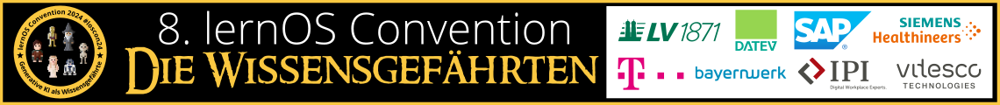

# Willkommen zur lernOS Convention 2024 💛

Die **lernOS Convention** ist das Top-Event zu **Wissensmanagement** und **Lernenden Organisationen** im deutschsprachigen Raum. Der digitale Arbeitsplatz, moderne Intranets, New Ways of Working und persönliches Wissensmanagement für Wissensarbeiter:innen und Lernende Teams sind die zentralen Themen.

Die **8. lernOS Convention** ([#loscon24](https://colearn.social/tags/loscon24)) findet vom **2.-3. Juli 2024** auf der **Kaiserburg Nürnberg** & **Online** per MS Teams statt (hybride Veranstaltung). Das Motto ist **“Generative KI als Wissensgefährten”** (s.a. [Blog dazu](https://cogneon.de/2024/05/18/generative-ki-als-wissensgefaehrte-das-thema-der-lernos-convention-2024/)), im Zentrum steht die Frage, wie wir die Generative KI (GenAI, z.B. ChatGPT, Microsoft Copilot) in den Alltag unserer Wissensarbeit integrieren können, um dadurch produktiver und kreativer zu werden.

Auf diesen **Infoseiten** findet ihr alle Informationen zur Veranstaltung. Die **Tickets** für Vor-Ort- und Online-Teilnahme sind [über den Ticketshop](https://pretix.eu/cogneon/loscon24/) verfügbar.

<button type="button"><a href="https://pretix.eu/cogneon/loscon24/" target="_blank">Zur loscon24 anmelden</a></button> <button type="button"><a href="https://cogneon.de/2024/05/18/generative-ki-als-wissensgefaehrte-das-thema-der-lernos-convention-2024/" target="_blank">Blog zum loscon24 Thema</a></button>

!!! Tipp
    Der [Call for Participation](https://pretalx.com/loscon24/cfp) (CfP) ist schon geöffnet, ihr könnt bereits **Lightning Talks** mit Erfahrungsberichten aus dem lernOS KI MOOC und Vorschläge für **Sessions** mit KI-Bezug einreichen.

<a href="https://logwork.com/countdown-4y9k" class="countdown-timer" data-timezone="Europe/Berlin" data-language="de" data-date="2024-07-02 10:00">loscon24 Countdown</a>

# Programm
Als Multiformat-Event wird die lernOS Convention wieder ein vielfältiges Angebot an Programmpunkten bieten:

1. **Impulsvorträge (20'')** zum [Leitthema der Veranstaltung](https://cogneon.de/2024/05/18/generative-ki-als-wissensgefaehrte-das-thema-der-lernos-convention-2024/)
1. **Lightning Talks (5'')** mit den wichtisten Erkenntnissen aus dem [lernOS KI MOOC](http://localhost:8000/kimooc24/)
1. Viel Raum für **Vernetzung und Austausch**, vor Ort und online
1. Format [Barcamp](https://de.wikipedia.org/wiki/Barcamp) an Tag 2 mit 4 Tracks x 4 **Sessions** (45'')
1. **Podcast-Tisch** zum Erlernen von Podcasting und zur Aufnahme von Episoden (s.a. [lernOS Podcast Leitfaden](https://cogneon.github.io/lernos-podcasting/de/))
1. **Vernetzungsteische**, damit sich auch Neueinsteiger:innen schnell in die Community eingebunden fühlen
1. **Flanieren** mit guten Gesprächen im [Burggarten der Kaiserburg](https://www.schloesser.bayern.de/deutsch/garten/objekte/nbg_burg.htm)
1. **Abendprogramm** mit Prompt Battle, bei dem sich 8 Personen im Prompten messen können

# Wichtige Termine

- **19.01.:** Golive Website [cogneon.de/loscon24](https://cogneon.de/loscon24) und Ticketshop
- **26.01.:** Orga-Team Call for Participation (13:00 - 14:00 Uhr, Info-Termin für alle, die mit dem Gedanken spielen, in der Orga mitzuhelfen)
- **02.02.:** Start der Orga-Calls des loscon24 Teams (jeweils Freitags, 10:00 - 11:00 Uhr)
- **29.02.:** Ende der Anmeldephase für Gutscheine Leitfaden-Teams
- **01.03.:** Start Promo und Social Media Aktivitäten
- **04.03.:** Golive [Call for Participation](https://pretalx.com/loscon24/cfp) (Einreichung von Programmvorschlägen)
- **06.05.-21.06.:** [lernOS Künstliche Intelligenz (KI) MOOC](kimooc24.md)
- **01.06.:** Programm Version 1.0 ist fertig (kuratiertes Programm, Hälfte der Barcamp-Sessions)
- **25.06.:** Vorab-Webkonferenz (13:00 - 14:00 Uhr), Infomail an Teilnehmer:innen mit Einladung in loscon24-Discord-Server und Kalendereinträgen
- **01.07.:** Aufbau in der Burg (voraussichtlich ab Mittag)
- **01.07.:** [Vorabend-Treffen](eve.md) bei der Eröffnungsveranstaltung des [Nürnberg Digital Festivals](https://nuernberg.digital) (kostenlose Anmeldung notwendig)
- **02.-03.07.:** [lernOS Convention 2024](https://cogneon.de/loscon24)
- **12.07.:** loscon24 Retro des [Orga-Teams](orga-team.md) (10:00 - 11:00 Uhr)

# Eindrücke der loscon23

<iframe width="560" height="315" src="https://www.youtube-nocookie.com/embed/W0UaN3bcmXc?si=ObdDokULBMWcYWjI" title="YouTube video player" frameborder="0" allow="accelerometer; autoplay; clipboard-write; encrypted-media; gyroscope; picture-in-picture; web-share" referrerpolicy="strict-origin-when-cross-origin" allowfullscreen></iframe>

