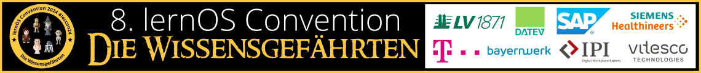

# Willkommen zur lernOS Convention 2024!

Das sind die Infoseiten zur [lernOS Convention 2024](https://cogneon.de/loscon24). Die Tickets für Vor-Ort- und Online-Teilnahme sind [über den Ticketshop](https://pretix.eu/cogneon/loscon24/) verfügbar. Hier werdet ihr alle Infos zur Veranstaltung finden.

# Wichtige Termine
- **19.01.:** Golive Website cogneon.de/loscon24 und Ticketshop
- **26.01.:** Orga-Team Call for Participation (13:00 - 14:00 Uhr, Info-Termin für alle, die mit dem Gedanken spielen, in der Orga mitzuhelfen)
- **02.02.:** Start der Orga-Calls des loscon24 Teams (jeweils Freitags, 10:00 - 11:00 Uhr)
- **29.02.:** Ende der Anmeldephase für Gutscheine Leitfaden-Teams
- **01.03.:** Start Promo und Social Media Aktivitäten
- **04.03.:** Golive Call for Participation (Einreichung von Programmvorschlägen)
- **06.05.-21.06.:** lernOS Künstliche Intelligenz (KI) MOOC ([Voranmeldung](https://www.meetup.com/de-DE/cogneon/events/297769514/))
- **01.06.:** Programm Version 1.0 ist fertig (kuratiertes Programm, nicht Barcamp-Sessions)
- **25.06.:** Vorab-Webkonferenz (13:00 - 14:00 Uhr), Infomail an Teilnehmer:innen mit Einladung in loscon24-Discord-Server und Kalendereinträgen
- **26.06.:** Programm Version 2.0 ist fertig (Barcamp-Sessions)
- **01.07.:** Aufbau in der Burg (voraussichtlich ab Mittag)
- **01.07.:** Vorabend-Treffen voraussichtlich bei der Eröffnungsveranstaltung des [Nürnberg Digital Festivals](https://nuernberg.digital)
- **02.-03.07.:** [lernOS Convention 2024](https://cogneon.de/loscon24)
- **12.07.:** loscon24 Retro (10:00 - 11:00 Uhr)

> **_HINWEIS:_**  Die Infoseiten befinden sich noch im Aufbau. Die Inhalte können sich jederzeit ändern und noch unvollständige/falsche Informationen enthalten.

