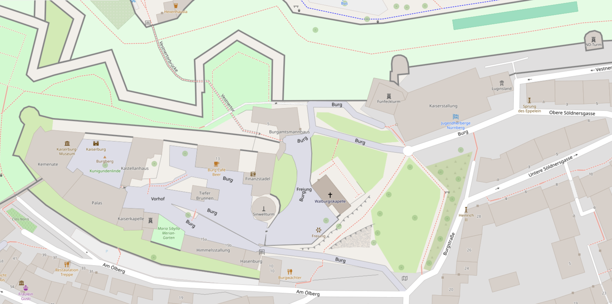

# Lokation

**Adresse:** 
Kaiserburg Nürnberg ([OpenStreetMap](https://openstreetmap.de/karte/?zoom=19&lat=49.45794&lon=11.07699&layers=B00TT), [Google Map](https://maps.app.goo.gl/VuHSpyymTumF3mmG6), Eingang am Fünfeckturm) 
Burg 2 
90403 Nürnberg

# Räume
In der Burg nutzen wir folgende Räumlichkeiten (s.a. [Tagen in Nürnberg](https://www.jugendherberge.de/jugendherbergen/nuernberg/tagen/)):

- **Foyer:** Empfang und Garderobe
- **Eppeleinsaal:** Coworking & Plenum
- **Räume 6-9:** Breakout-Räume für Sessions und Workshops
- **Foyer (1.Stock):** Sofas für private Gespräche und individuelle Teilnahme an Konferenzen

# Umgebung
- [Burggarten](https://www.kaiserburg-nuernberg.de/deutsch/garten/index.htm) (schöner Garten direkt gegenüber von unserem Eingang, gut zum Flanieren geeignet)
- [Hexenhäusle](https://hexenhaeusle-nuernberg.com/) (Biergarten direkt in der Burgmauer)
- [Restaurant Burgwächter](https://burgwaechter-nuernberg.de/) (traditionell fränkisches Restaurant, direkt unterhalb der Burg)
- [Hausbrauerei Altstadthof](https://hausbrauerei-altstadthof.de/) (hier gibt es das Nürnberger Rotbier, Ausgangspunkt für eine Tour durch die [historischen Felsengänge](https://www.historische-felsengaenge.de/))